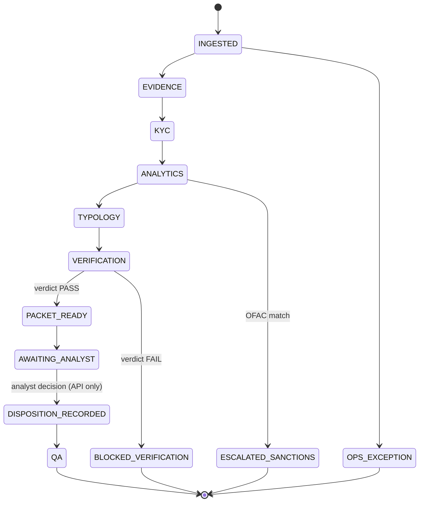

# Data model reference

Sources: `src/domain/`, `src/orchestrator/state.ts`, `src/tools/`, `src/audit/`.

## Source IDs

Every fact carries a source ID of the form `<layer>:<provenance>:<key>`
(`src/domain/ids.ts`, regex `^(txn|sdn|kyc|alert|policy|note):[a-zA-Z0-9_.-]+:[a-zA-Z0-9_.:-]+$`).

| Layer | Example | Source | Real? | UI badge |
|---|---|---|---|---|
| `txn` | `txn:ibm:HI-Small:423257` | IBM AMLworld transaction row | Yes | Green |
| `sdn` | `sdn:ofac:2026-09-10:10002` | OFAC SDN entry (list date : entity number) | Yes | Green |
| `policy` | `policy:ffiec-appF:funds-transfers:6` | FFIEC Appendix F clause (section : index) | Yes | Green |
| `kyc` | `kyc:overlay:8075AC7C0:v1` | Generated customer profile | No | Amber |
| `alert` | `alert:tm:8075AC7C0:gather-scatter` | Monitoring alert raised by a rule (below) over the real transactions | Simulated | Amber |
| `note` | `note:overlay:8075AC7C0:1` | Generated analyst note or wire memo | No | Amber |

The `policy:` prefix is a UI and drill-through convention. Typology matches store the bare clause ID
(`ffiec-appF:funds-transfers:6`).

## Case states

`assertTransition()` throws `IllegalTransitionError` for any move not in this table. Terminal states:
`QA`, `BLOCKED_VERIFICATION`, `ESCALATED_SANCTIONS`, `OPS_EXCEPTION`. The pipeline itself stops at
`AWAITING_ANALYST`. Only `POST /cases/:id/analyst/decision` can leave it.

| State | UI label |
|---|---|
| none (never run) | Not run |
| `INGESTED` … `PACKET_READY` | Running |
| `AWAITING_ANALYST` | Needs decision |
| `ESCALATED_SANCTIONS` | Sanctions |
| `BLOCKED_VERIFICATION` | Blocked |
| `DISPOSITION_RECORDED`, `QA` | Decided |

## Agent output schemas

Each agent's output is validated against a Zod schema (`src/domain/agentOutputs.ts`). A response that
doesn't parse is a failure, not a partial result.

### EvidenceSummary (Evidence agent)

| Field | Type | Rule |
|---|---|---|
| `points[]` | `{ text, sourceIds[] }` | At least 1 point; each point cites at least 1 source ID |

### CustomerProfileAssessment (KYC/CDD agent)

| Field | Type |
|---|---|
| `expectedActivity` | string: profile-vs-behaviour comparison |
| `riskFactors` | string[] |
| `dataGaps` | string[]: flagged, never inferred |
| `stalenessDays` | number or null: days since the last KYC review, as of the alert date |

### TypologyAssessment (Typology agent)

| Field | Type | Rule |
|---|---|---|
| `matches[]` | `{ ffiecClauseId, policyVersion, supportingSourceIds[], strength }` | Clause ID must exist in `typologies.yaml` (checked by the verifier); `strength` is `low`, `medium` or `high`; at least 1 supporting source |
| `counterHypotheses` | string[] | **At least 1.** The confirmation-bias control, enforced by the schema |
| `dataGaps` | string[] | |

### VerificationResult (Verifier)

| Field | Type |
|---|---|
| `checks[]` | `{ claim, sourceId \| null, status }`, where status is `VERIFIED`, `UNSUPPORTED` or `MISMATCH` |
| `unsupportedClaims` | string[] |
| `recalcMismatches` | string[] |
| `verdict` | `PASS` or `FAIL`. `FAIL` withholds the packet |

### CasePacket (Coordinator agent)

| Field | Type | Rule |
|---|---|---|
| `summary` | string | The case memo |
| `findings[]` | `{ text, sourceIds[] }` | Each finding cites at least 1 source |
| `counterHypotheses` | string[] | At least 1 |
| `recommendation` | enum | `CLOSE`, `INVESTIGATE_FURTHER`, `ESCALATE_SANCTIONS`, `ESCALATE_EDD`, `CONSIDER_SAR` |
| `confidence` | number | 0 to 1 |
| `blockingGaps` | string[] | Must be resolved before a disposition |

### Computation (deterministic code)

`{ name, value, inputsHash, sourceIds[], codeVersion }`. Produced by `src/analytics/`, never by a model.
Money is kept apart by direction and currency. A row is an **inflow** (from another account), an **outflow**
(to another account) or a **self-transfer** (the account paying itself, often a currency conversion), which
counts as neither. Amounts in different currencies are never added together: cross-currency totals exist only as
US-dollar equivalents, named `...Usd`, converted with the rates the IBM simulator used
(`data/reference/fx-rates.json`, recovered from the dataset by `scripts/derive-fx-rates.ts`).

| Name | Meaning |
|---|---|
| `txnCount` | Every row touching the account |
| `inflowCount`, `outflowCount`, `selfTransferCount`, `selfFxConversionCount` | Rows by direction; conversions are self-transfers that change currency |
| `totalInUsd`, `totalOutUsd` | Money in from and out to other accounts, US-dollar equivalent |
| `inflow:<currency>`, `outflow:<currency>` | Native totals, one per currency |
| `outflowToInflowRatio` | `totalOutUsd ÷ totalInUsd`, **not capped**. Near 1: funds pass straight through. Far above 1: more left than arrived, so the source is not visible. Omitted when nothing came in |
| `currencyCount`, `cashTxnCount`, `velocityTxnPerDay` | |
| `nearThresholdCashCount`, `nearThresholdCashTotalUsd` | Cash worth $8,500 to $9,999, just under the $10,000 reporting threshold |
| `inDegree`, `outDegree`, `mutualCounterpartyCount` | Distinct senders, recipients, and counterparties seen both ways |
| `formatBreakdown:<format>:count`, `formatBreakdown:<format>:totalUsd` | Channel mix over every row, US-dollar equivalent |
| `sanctionsMatchScore` | Best OFAC name similarity, 0 to 1 |

Before prompt version 1.3.0 the totals summed every row touching the account, counting what counterparties
received as this account's income, and added up to seven currencies as if they were dollars; the pass-through
ratio was capped at 1. C-001 showed "$324.8M received" and 1.00. It actually received about $0.11M from other
accounts and paid out about $117M (1,050x).

## Monitoring alerts

Alerts are raised by fixed rules in `src/analytics/alertRules.ts`, never assigned by hand:
`tests/alerts.test.ts` re-runs every rule and fails if `data/overlay/alerts.json` differs. Each alert records its
rule and version, the condition, what the account showed, the triggering records, and `firedAt`, the time of
the triggering transaction. The earliest alert is the one that opened the case, and the investigation's as-of
date (including KYC staleness) is measured from it.

The thresholds are illustrative prototype values chosen from each typology, not calibrated to a real bank.

| Rule | Fires when | Cases |
|---|---|---|
| `structuring-near-threshold-cash` v1 | 3+ cash transactions worth $8,500 to $9,999 within 7 days | none |
| `gather-scatter` v1 | 10+ distinct senders and 10+ distinct recipients within 30 days | C-001, C-004, C-007 |
| `fan-out` v1 | 10+ distinct recipients, at most 9 distinct senders, within 30 days | C-003 |
| `fan-in-burst` v1 | 20+ distinct senders within 60 minutes | C-002, C-005, C-008 |
| `fx-conversion-then-transfer` v1 | 3+ times: a self currency conversion, then a payment out in the new currency within 60 minutes | C-001, C-004, C-007 |
| `outflow-exceeds-inflow` v1 | Money out is more than 2x money in and at least $100,000 (USD equivalent) | C-001, C-003, C-007 |
| `sanctions-name-screen` v1 | Account holder name has similarity 0.85+ to an OFAC name or alias | C-005 |
| `kyc-review-overdue` v1 | No KYC review on file, or the last one is more than 365 days old | all 8 |

C-006's transactions trip no monitoring rule: only the periodic KYC review opened it.

## Tool permission classes

Agents never call tools themselves (see [ADR 0002](../decisions/0002-code-computes-ai-explains.md)). The
registry (`src/tools/registry.ts`) serves orchestrator and API code. Every call passes the permission gate
(`src/tools/permissions.ts`), and each check is written to the audit log.

| Class | Rule | Tools |
|---|---|---|
| `READ_ONLY` | Allowlist + case scope | `getAlert`, `getTransactions`, `getKyc`, `getPriorCases`, `searchPolicy` |
| `DERIVED` | Allowlist + case scope | `computeAggregates`, `computeGraph`, `detectPatterns`, `screenSanctions` |
| `DRAFT` | Allowlist + case scope; writes only to `aiDrafts` | `writeDraftNote`, `writeDraftNarrative` |
| `SOR_WRITE` | Also needs an approval token and a single-use idempotency key | `createResearchTask`, `updateCaseStatus` |
| `ADVERSE` | Always denied | **None exist.** No SAR filing, account closure or fund blocking |

## Audit events

Every event goes to `audit/case-<id>.jsonl` in full and to `audit/generic.jsonl` redacted
(`src/audit/log.ts`). `appendAuditEvent` is the only write path.

| Type | Key fields |
|---|---|
| `model_call` | `agentName`, `model`, `promptVersion`, `policyVersion`, `effort`, `cassetteKey`, `cassetteMode`, `usage`, `latencyMs` |
| `tool_check` | `toolName`, `agentName`, `decision` (`allow` or `deny`), `reason` |
| `state_transition` | `fromState`, `toState`, `reason` |
| `analyst_decision` | `analystId`, `disposition`, `rationale`, `overrideReason`, `aiRecommendation` |

Redacted in the generic log and for non-SAR-scoped readers: `recommendation`, `disposition`,
`rationale`, `overrideReason`, `narrative`, `sarConfidentialitySensitive`, `summary`, `findings`,
`counterHypotheses` (`src/audit/redact.ts`).
